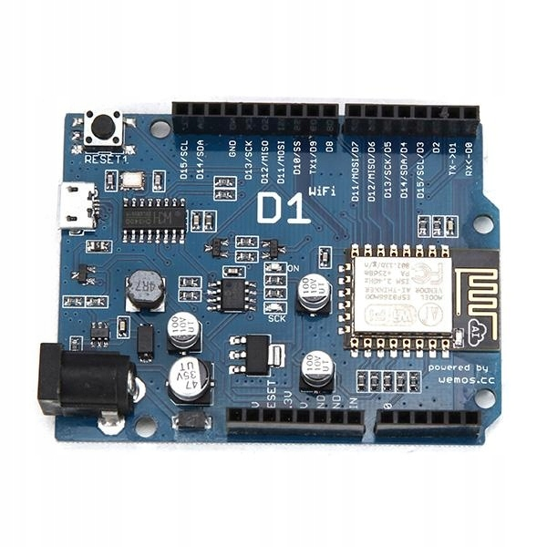

# esp8266-dust-sensor-project
Software for microcontroller ESP8266, which is a part of project "Dust Sensor Project"

## Microcontroller ES8266
Microcontroller esp8266 is one of the most popular microcontroller which can act as module WIFI. 
<kbd></kbd>

Software ESP826 was developed using Arduino IDE.

Targets of ESP8266 are:
- connection with microSD card:
  * loading requiered data to do network connection and data for configuration
  * saving measurement results on a microSD card
- doing network connection:
  * determining location based on information about cell towers and WIFI nodes that the module WIFI can detect
  * loading configuration data from MySQL Database
  * saving measurement results to MySQL Database,
  * sending periodic information about the status of device
